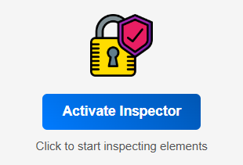
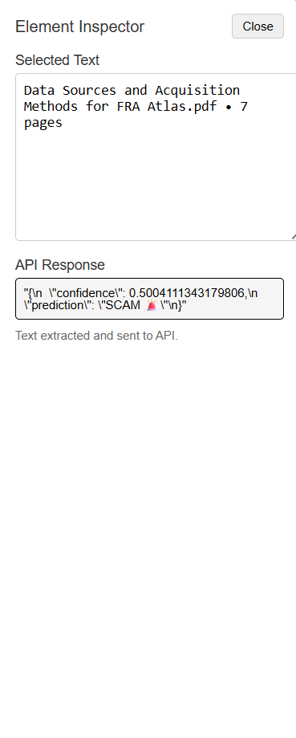
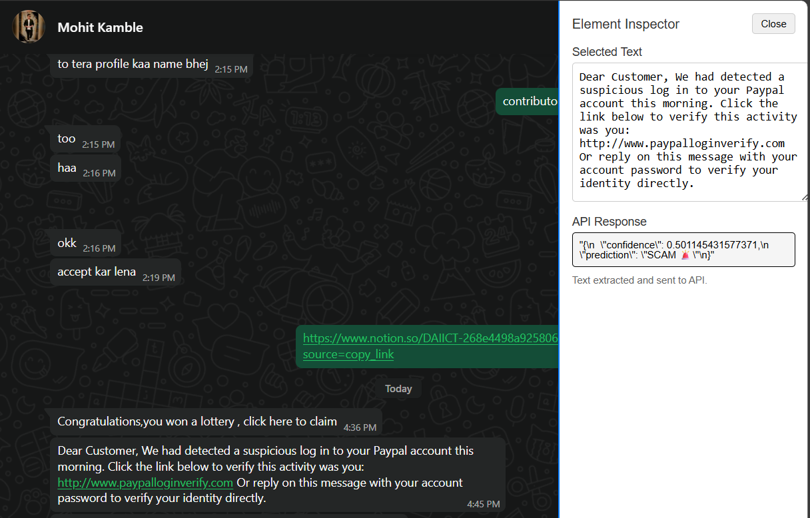

# 🛡 Fraud Detection System

A machine learning-powered system designed to detect fraudulent transactions in real-time. This project combines Python-based data science with a JavaScript server infrastructure to provide an end-to-end fraud detection solution.

---

## 📸 Extension Screenshots  

### 🔹 Extension Popup

  

### 🔹 Sidebar Analysis  

  

### 🔹 Scam Detection Example  

  

---

## 🚀 Features

- ✅ Real-time fraud detection
- 🔍 Machine learning model for transaction analysis
- 🧠 Intelligent behavior analysis using GuardAI module
- 🌐 REST API for integration with web or mobile applications
- 📈 Visualization and logging of prediction results

<!-- Image Placeholder: Feature Showcase or Screenshot -->

## 🧠 Tech Stack

| Layer         | Technology                          |
|---------------|-------------------------------------|
| Frontend      | HTML, JavaScript                    |
| Backend       | Node.js (server_live)               |
| ML Model      | Python (scikit-learn, pandas, etc.) |
| Data Handling | CSV / JSON pipelines                |
| Deployment    | Localhost / Cloud-ready             |

<!-- Image Placeholder: Tech Stack Diagram -->

## 📁 Project Structure

Fraud_detection_system/
│
├── model/               # ML model training and evaluation
├── server_live/         # Node.js backend serving predictions
├── GaurdAI/             # Security and monitoring logic
├── test/                # Unit and integration tests
└── utils/               # Helper functions, data processing

## 📊 Machine Learning Model

The model is trained on historical transaction data to identify patterns indicative of fraud. It considers features such as:

- Transaction amount
- Location
- Timestamp
- User behavior patterns
- Device fingerprint

*Model Type*: Random Forest / XGBoost / Logistic Regression  
*Metrics Used*: Accuracy, Precision, Recall, F1-score, ROC-AUC

## ⚙ How to Run

### 1. Clone the Repository
bash
git clone https://github.com/Theshmphony7580/Fraud_detection_system.git
cd Fraud_detection_system

### 2. Install Dependencies
#### For Python (ML Model)
bash
cd model
pip install -r requirements.txt

#### For Node.js (Backend)
bash
cd ../server_live
npm install

### 3. Run the Backend Server
bash
node index.js

### 4. Run the ML Model (for Testing or Retraining)
bash
cd ../model
python train_model.py

<!-- Image Placeholder: Setup or Workflow Screenshot -->

## 📈 Example API Request
*Endpoint*: POST /predict

*Request Body*:
json
{
  "transaction_id": "TX12345",
  "amount": 420.75,
  "location": "New York, USA",
  "timestamp": "2025-09-12T14:30:00Z",
  "user_id": "U56789"
}

*Response*:
json
{
  "fraudulent": true,
  "confidence": 0.92
}

## 🛡 GuardAI Module
A lightweight security layer that monitors prediction confidence, flags suspicious patterns, and integrates alerting logic.

*Features*:
- Rate-limiting suspicious API calls
- Confidence threshold alerts
- Logging anomalous patterns

<!-- Image Placeholder: GuardAI Workflow or Alert Example -->

## 📌 TODO / Roadmap
- Add unit tests for API endpoints
- Improve data preprocessing with more robust pipelines
- Integrate visualization dashboard (e.g., with Plotly or D3.js)
- Add Docker support for deployment

## 🧑‍💻 Contributing
Contributions are welcome! To contribute:
1. Fork the repository.
2. Create a new branch (git checkout -b feature-branch).
3. Make your changes and commit them (git commit -m 'Add some feature').
4. Push to the branch (git push origin feature-branch).
5. Open a pull request.

Please ensure your code follows the project's coding standards and includes appropriate tests.

## 📄 License
This project is licensed under the [MIT License](LICENSE).

## 🙌 Acknowledgements
Thanks to all open-source contributors and libraries used in this project!

<!-- Image Placeholder: Contributor or Community Graphic -->
